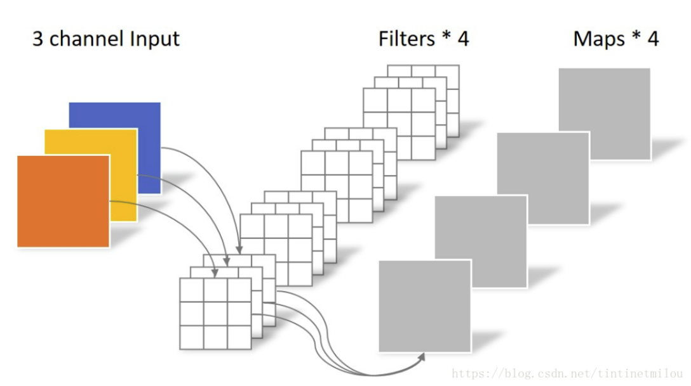

卷积方式
=============================
反卷积（转置卷积）和上采样和反池化（为了增加特征图大小）
---------------
在ＦＣＮ中恢复图像原有尺寸
[反卷积链接](https://zhuanlan.zhihu.com/p/48501100)

深度可分离卷积和点分离卷积都是为了降低模型复杂度的.

常规卷积
------------

深度可分离卷积
---------

点分离卷积
--------------

分组卷积
--------------

！

Shuffle-Net V1
---------------------------
分组卷积
--------------

在分组卷积的基础上，在组内运用pointwise卷积,flops计算量会变为F=9×h×w+h×w×c1×c2/g这样就会形成类似多个一个样的网络结构构成的模型集成，为了解决通道沟通问题，进行了通道洗牌（channel shuffle）