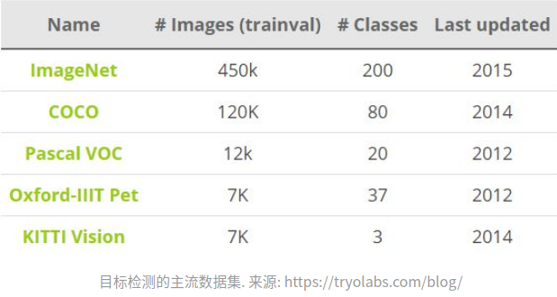

目标检测
==============
目标检测常用的数据集包括PASCAL VOC，ImageNet，MS COCO等数据集，这些数据集用于研究者测试算法性能或者用于竞赛。目标检测的性能指标要考虑检测物体的位置以及预测类别的准确性，下面我们会说到一些常用的性能评估指标。

性能指标
===========
目标检测问题同时是一个回归和分类问题。首先，为了评估定位精度，需要计算IoU（Intersection over Union，介于0到1之间），其表示预测框与真实框（ground-truth box）之间的重叠程度。IoU越高，预测框的位置越准确。因而，在评估预测框时，通常会设置一个IoU阈值（如0.5），只有当预测框与真实框的IoU值大于这个阈值时，该预测框才被认定为真阳性（True Positive, TP），反之就是假阳性（False Positive，FP）。

对于二分类，AP（Average Precision）是一个重要的指标，这是信息检索中的一个概念，基于precision-recall曲线计算出来，详情见这里。对于目标检测，首先要单独计算各个类别的AP值，这是评估检测效果的重要指标。取各个类别的AP的平均值，就得到一个综合指标mAP（Mean Average Precision），mAP指标可以避免某些类别比较极端化而弱化其它类别的性能这个问题。

对于目标检测，mAP一般在某个固定的IoU上计算，但是不同的IoU值会改变TP和FP的比例，从而造成mAP的差异。COCO数据集提供了官方的评估指标，它的AP是计算一系列IoU下（0.5:0.05:0.9，见说明）AP的平均值，这样可以消除IoU导致的AP波动。其实对于PASCAL VOC数据集也是这样，Facebook的Detectron上的有比较清晰的实现。

除了检测准确度，目标检测算法的另外一个重要性能指标是速度，只有速度快，才能实现实时检测，这对一些应用场景极其重要。评估速度的常用指标是每秒帧率（Frame Per Second，FPS），即每秒内可以处理的图片数量。当然要对比FPS，你需要在同一硬件上进行。另外也可以使用处理一张图片所需时间来评估检测速度，时间越短，速度越快。

后面需要看看的
mask-rcnn
yoloV3

thunder net实时目标检测

backbone
mobile net V2
shufflenet V2 
efficient net

anchor free----network
center net

polarmask实例分割
mask scoring实例分割
=======

！
>>>>>>> 72a74ea6b6ec37097f1b8e4ba579fbcc8c49ecb0
