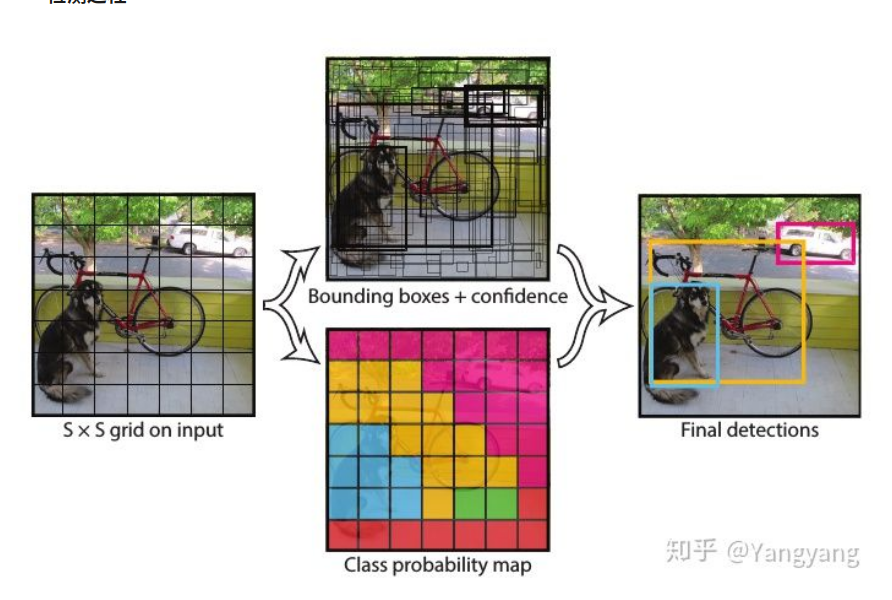
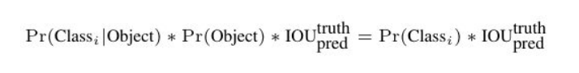

单阶段（1-stage）检测模型YOLO-V1
=======================
速度快
泛化性能好

yolo v1

使用的googlenet作为backbone,输入尺寸为固定(448×448), 卷积之后的输出7×7×30

思路：
1，数据准备，将图片缩放，划分为等分的网格，对每个网格按照gt的iou分配需要预测的样本
2，卷积网络，对每个网格的每个类别预测一个概率值，并在网格的基础上生成B个box，每个box预测五个回归值，四个表征位置，第五个表征这个box含有物体（注意不是某一类物体）的概率和位置的准确程度（由IoU表示）。

等式左边第一项由网格预测，后两项由每个box预测，以条件概率的方式得到每个box含有不同类别物体的分数。 因而，卷积网络共输出的预测值个数为S×S×(B×5+C)其中S为网格数，B为每个网格生成box个数，C为类别数。
3,非极大抑制，过滤得到最后的预测框。

损失函数被分为三部分：坐标误差、物体误差、类别误差。为了平衡类别不均衡和大小物体等带来的影响，损失函数中添加了权重并将长宽取根号。

缺点：
1. 精度不够
2. 容易产生错误定位
3. 小目标检测困难

yolo-V2
===================
YOLOv2在V1基础上做出改进后提出。其受到Faster RCNN方法的启发，引入了 anchor。同时使用了K-Means方法，对 anchor 的外形尺寸进行了讨论，在精度和速度之间做出折中。并且修改了网络结构，去掉了全连接层，改成了全卷积结构。在训练时引入了世界树(WordTree)结构，将检测和分类问题做成了一个统一的框架，并且提出了一种层次性联合训练方法，将ImageNet分类数据集和COCO检测数据集同时对模型训练。

yolo-V3
=====================

边界框回归
跟YOLO系列的方式一样，每个先验框负责与其匹配（IOU最大）的ground truth的预测，即计算对应 coordinate loss 和 class loss，每个ground truth只与一个先验框匹配，没有匹配的先验框只计算 objectness loss，采用平方差损失。

类别预测
YOLOv3采用了多标签分类，将softmax分类器换成了对每一个类别使用独立的logistic分类器，训练时使用 binary cross-entropy loss 。这样做的好处是可以在一些更复杂的数据集（即样本有很多 overlapping labels，比如女人和人）上取得更好的效果。

多尺度预测
YOLOv3预测三种不同大小的box,并且借鉴了feature pyramid networks（FPN）的思想，将网络中一些深层特征图上采样之后，与浅层相同大小特征图在深度方向拼接concatenate，得到语义信息更丰富（来自较后面的特征图）且分辨率更高（较前面的特征图）的组合特征图，建议详细阅读一下FPN。

同时采用了多尺度预测（即在不同特征图上进行预测，不理解多尺度预测的可以看我的另一篇文章 SSD 算法），每个尺度上预测为  ，特征图大小N X N，先验框个数 3，box偏移参数 4，物体置信度 1 ,COCO类别数80。

先验框的选择方法跟YOLOv2相同使用k-means聚类。COCO数据集上选择了9种横纵比和3种大小的先验框。

训练阶段没有进行 hard negative mining，采用了多尺度训练以及很多数据增强的方法。同时作者在文中介绍了一些他们尝试了却没有效果的方法，比如引入Focal loss、更改预测anchor参数方式、线性激活代替逻辑回归预测、双重IOU阈值等等。