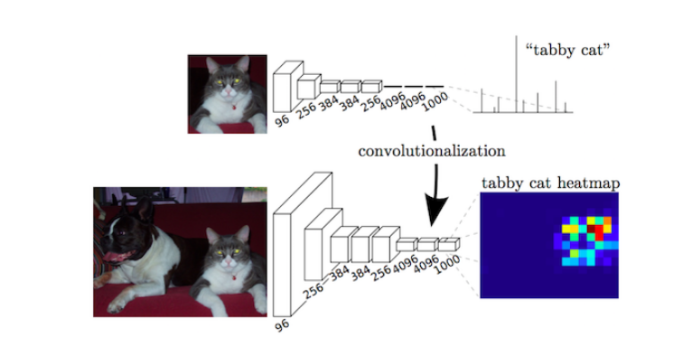

FCN网络
==================

主要贡献
-----------------
+ 将端到端的卷积网络推广到语义分割中;

+ 重新将预训练好的Imagenet网络用于分割问题中;

+ 使用反卷积层进行上采样;

+ 提出了跳跃连接来改善上采样的粗糙程度。（直接加和）

全连接网络结构，在之前的cnn的基础之上加了，全连接层(不是使用简单的双线性插值，上卷积层)deconvolutions实现．（见卷积方式汇总）
反卷积比插值好在哪？？
反卷积的kenerl是可以学习的

完全卷积网络(Fully Convolutional Networks)，
推广了原有的CNN结构，在不带有全连接层的情况下能进行密集预测。
除了全连接层结构，在分割问题中很难使用CNN网络的另一个
问题是存在池化层。池化层不仅能增大上层卷积核的感受野，而且能聚合背景同时丢弃部分位置信息。然而，语义分割方法需对类别图谱进行精确调整，
因此需保留池化层中所舍弃的位置信息。