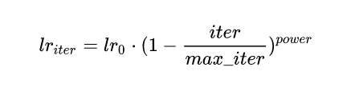

deeplabV2
======================
1. 对比V1最大改变是加入了受空间金字塔池化（spp）启发得来的ASPP（Atrous Spacial Pyramid Pooling）（空洞卷积空间池化特征金字塔），在模型最后进行像素分类之前增加一个类似 Inception 的结构，包含不同 rate（空洞间隔） 的 Atrous Conv（空洞卷积），增强模型识别不同尺寸的同一物体的能力
2. 另外，DeepLabv2 采用了 Poly 的训练策略：



在训练过程中动态调整学习率。（可以借鉴）
```
from torch.optim.lr_scheduler import _LRScheduler


class PolynomialLR(_LRScheduler):
    def __init__(self, optimizer, step_size, iter_max, power, last_epoch=-1):
        self.step_size = step_size
        self.iter_max = iter_max
        self.power = power
        super(PolynomialLR, self).__init__(optimizer, last_epoch)

    def polynomial_decay(self, lr):
        return lr * (1 - float(self.last_epoch) / self.iter_max) ** self.power

    def get_lr(self):
        if (
            (self.last_epoch == 0)
            or (self.last_epoch % self.step_size != 0)
            or (self.last_epoch > self.iter_max)
        ):
            return [group["lr"] for group in self.optimizer.param_groups]
        return [self.polynomial_decay(lr) for lr in self.base_lrs]
```
