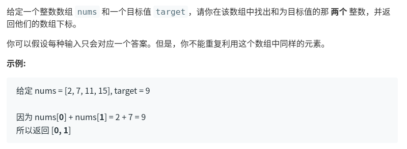

两数之和
===================

题目描述：给定一个列表和一个整数a，让找到列表中是否存在两个数相加等于a，如果有输出两个数的index。

题目链接：[两数之和](https://leetcode-cn.com/problems/two-sum/)


思路一：从第一个遍历，每次判断第i个数和他后面剩下的依次相加，判断是否等于target


第一种:暴力求解
```
class Solution:
    def twoSum(self,nums, target):
        l=len(nums)
        for i in range(l):
            for j in range(i+1,l):
                if (nums[i]+nums[j])==target:
                    return [i,j]
```
6192ms,速度特别慢

第二种:字典模拟哈希求解，直接寻找，target-i是否在字典中。
```
class Solution:
    def twoSum(self,nums, target):
        hashmap={}
        for ind,num in enumerate(nums):
            hashmap[num] = ind
        for i,num in enumerate(nums):
            j = hashmap.get(target - num)
            if j is not None and i!=j:
                return [i,j]
```
52ms比较快捷