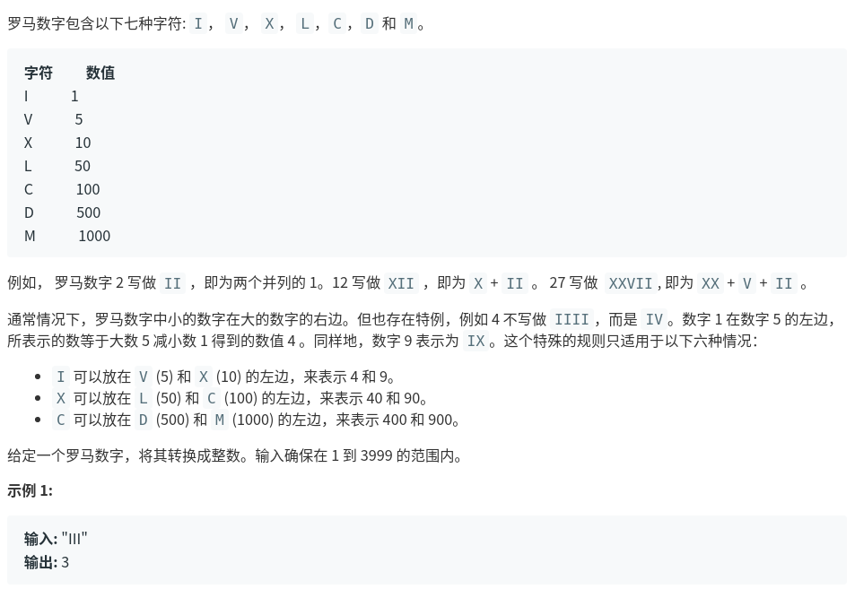

罗马数字转整数
===========================
题目链接：
[罗马数字转整数](https://leetcode-cn.com/problems/roman-to-integer/)



思考，这一题主要是要计算出每个字符的数量，然后计算出['CD', 'CM', 'XL', 'XC','IV', 'IX']这些字符串出现的次数，这些出现了之后，对应的要相减，比如出现3个C，正常是要加300，但是如果有一个CD，一个CM，一个C，那么计算C对应的值需要减去2个100，然后加一个100.
程序对应如下
```
class Solution:
    def romanToInt(self, s: str) -> int:
        num_list = []
        for i in ['M', 'D', 'C', 'L', 'X', 'V', 'I']:
            num_i = s.count(i)
            num_list.append(num_i)

        num_list1 = []
        for j in ['CD', 'CM', 'XL', 'XC','IV', 'IX']:
            num_j = s.count(j)
            num_list1.append(num_j)

        num_list2 = [num_list1[0] + num_list1[1],
                     num_list1[2] + num_list1[3], num_list1[4] + num_list1[5]]
        num = num_list[0] * 1000+num_list[1] * 500-num_list2[0] * 100 + (num_list[2] - num_list2[0]) * 100+num_list[3] * 50-num_list2[1] * 10 + (num_list[4] - num_list2[1]) * 10+num_list[5] * 5-num_list2[2] * 1 + (num_list[6] - num_list2[2]) * 1
        return num


sul = Solution()
print(sul.romanToInt("IV"))
```
执行用时 :80 ms, 在所有 python3 提交中击败了17.04%的用户

内存消耗 :12.7 MB, 在所有 python3 提交中击败了99.72%的用户

结果比较惨，参考别人的看看。一种比较好的思路是首先建立hashmap来映射字符和值，然后从左到右判断，如果左边比右边小，那么减去这个字符对应的值，否则就加、
```
def romanToInt_1(self, s: str) -> int:
    hashmap={'M':1000, 'D':500, 'C':100, 'L':50, 'X':10, 'V':5, 'I':1}
    print(len(s))
    list_str=list(s)
    num=hashmap[list_str[-1]]
    index=0
    while index < len(s)-1:
        if (hashmap[s[index]] >= hashmap[s[index+1]]):
            num+=hashmap[s[index]]
            index+=1
        else:
            num-=hashmap[s[index]]
            index+=1
    return num
```
执行用时 :48 ms, 在所有 python3 提交中击败了94.61%的用户

内存消耗 :12.7 MB, 在所有 python3 提交中击败了99.72%的用户
这种方式就比较快了