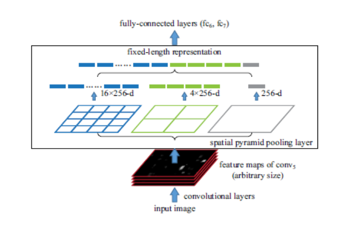

空间金字塔池化
=====================

[spp博客](https://blog.csdn.net/XZZPPP/article/details/51377731)

主要解决了提取特征时的池化过程中采用了4,2,1大小的池化核,那么对于一个w*h的图像来说

* 经过4*4池化之后图像大小变为w/4*h/4,总共有16个池化后的结果
* 经过2*2池化后图像大小变为w/2*h/2,总过有4个池化后结果
* 经过1*1池化之后图像大小变为w*h,总共有1个池化后结果

那么把这21个小图的最大值计算出来,当作一个21维的输出.
那么相当于池化的时候考虑到整个图像的所有尺度的特征

