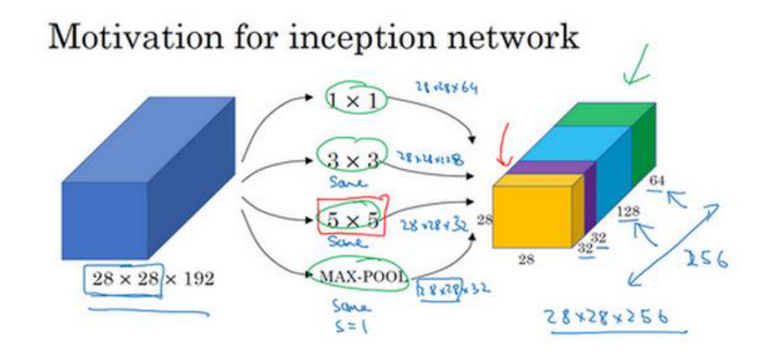
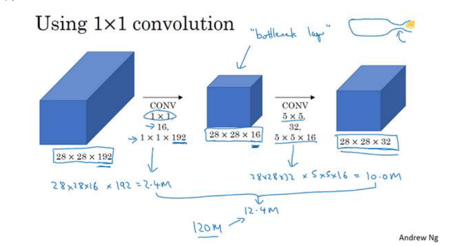

inception网络
==================

来自谷歌的inception网络

基本思想是,如果我们不确定在网络中采用多大的卷积核能达到最好的效果,那么就用一种平行结构,
采用不同的卷集核来对他进行卷积,最后叠加在一起,让网络自己去选择合适的卷积核

但是这样带来的计算成本是很大的.
那么就想到采用一个1*1的卷积和将输入的层数降低,然后采用inception结构,大大降低了计算量.

