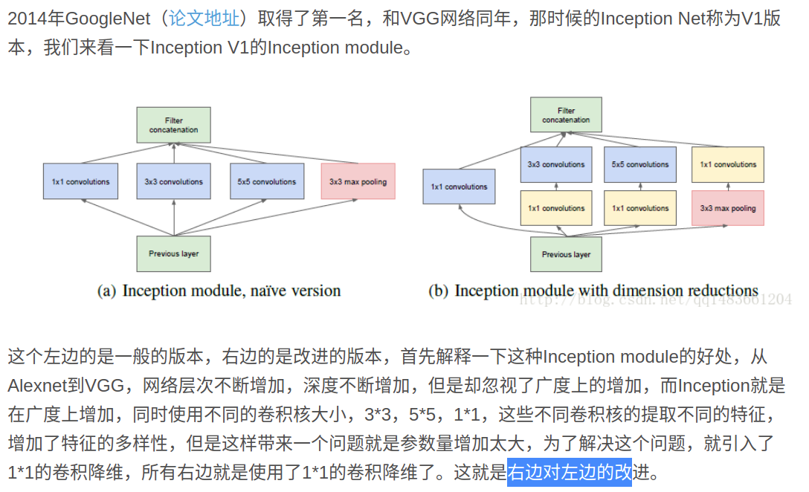
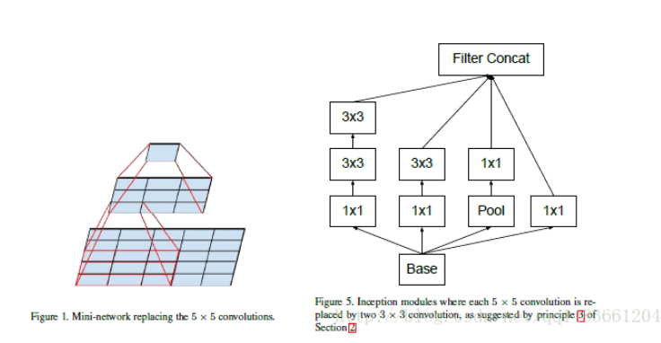
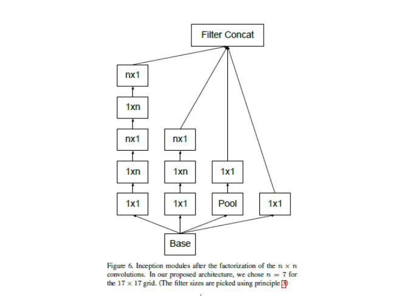

inception网络从V1-V4
==================
inception-V1
---------------------
来自谷歌的inceptionV1网络

基本思想是,如果我们不确定在网络中采用多大的卷积核能达到最好的效果,那么就用一种平行结构,
采用不同的卷集核（size为1,3，5的卷积核和3*3maxpooling）来对他进行卷积,最后叠加在一起,让网络自己去选择合适的卷积核

但是这样带来的计算成本是很大的.
那么就想到采用一个1*1的卷积和将输入的层数降低,然后采用inception结构,大大降低了计算量.

inception-V2
------------------------
基于inception-V1做的改进，使用2个3*3卷积核替换了之前的5*5的卷积核，这样做，结果不影响，但是减少了参数量，原来的计算量是25×C1×C2，现在是18×C1×C2.使网络夹深，提高非线性。
引进了bn层。

inceptionV3
-------------------------------
在V2的基础上做的改进。

从图上我们可以看出，Inception V3使用了7*1和1*7的卷积代替7*7，5*1核1*5代替5*5，总结起来就是，Inception V3就是使用两个1*n和n*1的卷积核取代n*n的卷积核。这样做，相比把5*5用两个3*3代替更加参数量少，加速了网络的变化。同时增加了一层非线性扩展模型表达能力。论文解释说，这种非对称的卷积结构拆分，其结果比对称地拆为几个相同的小卷积核效果更明显，可以处理更多、更丰富的空间特征，增加特征多样性。

inceptionV4
----------------------
使用了很多不同的inception block组合起来。
每个block还是使用了1*1卷积为了降低维度，也为了提高非线性性。

具体需要看论文。

inception-resnet
-----------------------
在v4的基础上引进了resnet的思想，也就是在每个边上增加了直连边，好处就是增加了线性性。融合了残差网络的好处。

xception网络
-------------------
在v3的基础上修改来的

在Xception中主要采用depthwise separable convolution

