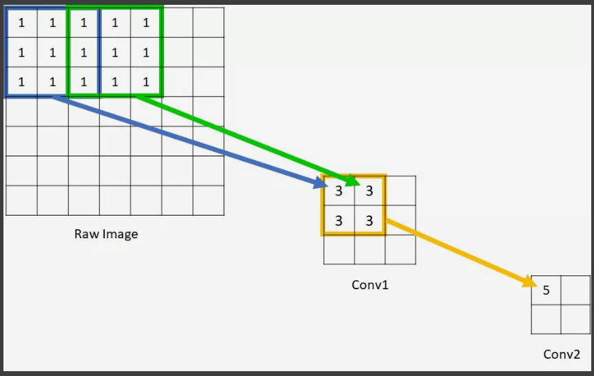
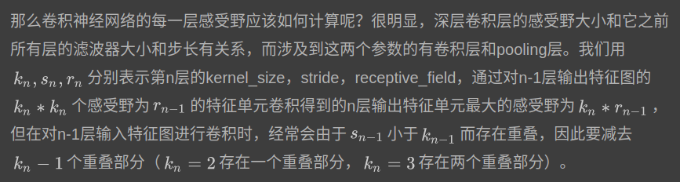
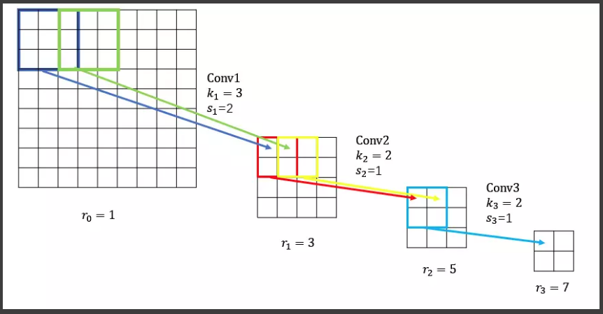
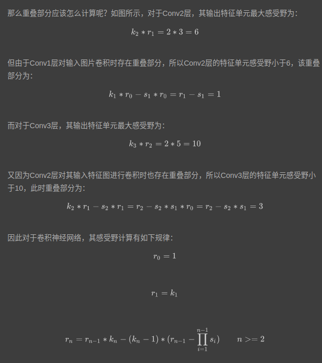

感受野
================
在卷积神经网络中，感受野（Receptive Field）的定义是卷积神经网络每一层输出的特征图（feature map）上每个像素点在原始图像上映射的区域大小，这里的原始图像是指网络的输入图像，是经过预处理（如resize，warp，crop）后的图像。

神经元之所以无法对原始图像的所有信息进行感知，是因为在卷积神经网络中普遍使用卷积层和pooling层，在层与层之间均为局部连接。

神经元感受野的值越大表示其能接触到的原始图像范围就越大，也意味着它可能蕴含更为全局，语义层次更高的特征；相反，值越小则表示其所包含的特征越趋向局部和细节。因此感受野的值可以用来大致判断每一层的抽象层次.

感受野的计算
如图所示的7*7原始图像，经过kernel_size=3, stride=2的Conv1，kernel_size=2, stride=1的Conv2后，输出特征图大小为2*2，很明显，原始图像的每个单元的感受野为1，Conv1的每个单元的感受野为3，而由于Conv2的每个单元都是由2*2范围的Conv1构成，因此回溯到原始图像，每个单元能够看到5*5大小的区域范围。

如上图.计算的时候,从第一层慢慢计算找规律,就可以了
$$ r1=k1*r0-F0 $$ 
其中F0是重叠部分   
比如求r1,
$$r1=k_1*r_0-F_0$$ 
其中F0是重叠部分
$$F0=(k_1-s_1)*r_0=k_1-s_1$$
那么对应的,一词计算$r_2$
$$r_n=k_n*r_(n-1)-F_(n-1)$$
$$F_(n-1)=(k_n-r_n)*r_(n-1)$$
当
$$r_0=1$$
$$r_1=k_1$$
的时候有
$$r_n=r_(n-1)*k_n-(k_n-1)*(r_(n-1)-\prod_{i=1}^(n-1) s_i) n>=2$$
上面公式只计算conv和pooling,padding不影响感受野.

github公式无法显示
