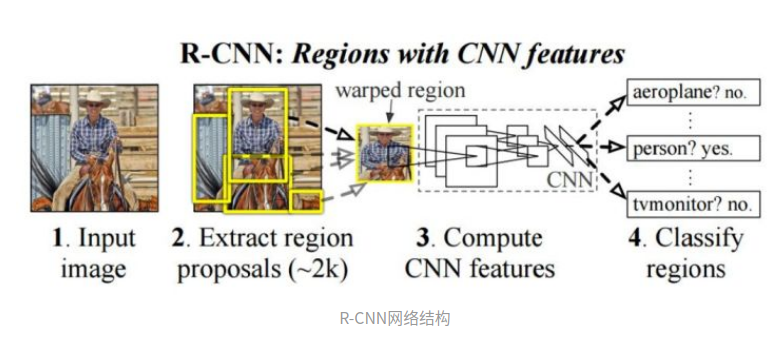

R-CNN
================
two-stage方法，R-CNN开山之作
两大贡献：
1. CNN可以用于基于区域的定位与分割物体
2. 训练样本缺少时候，可以用预训练fine-tune、

步骤：

第一步：使用局部裁剪（region proposal）

第二步：然后在局部区域上使用分类网络（当时的alex）得到每个区域的类别。

两个值得注意的做法：
第一点：本文那会采用了IOU计算的方式。训练之前要对gt的region proposal标记，使用IOU计算的。
正样本IOU>0.5，负样本IOU<0.1,两者之间为hard-negtives（难例）

第二点：坐标位置回归，采用了log、exp的方式，可以看做标注化，Nomalization