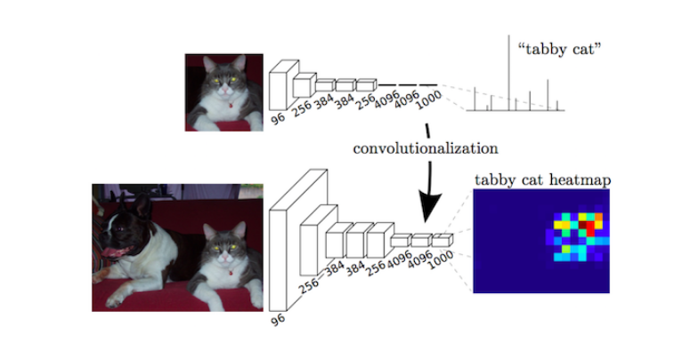

FCN网络
==================
全连接网络结构，在之前的cnn的基础之上加了，全连接层(不是使用简单的双线性插值，上卷积层)

完全卷积网络(Fully Convolutional Networks)，
推广了原有的CNN结构，在不带有全连接层的情况下能进行密集预测。
除了全连接层结构，在分割问题中很难使用CNN网络的另一个
问题是存在池化层。池化层不仅能增大上层卷积核的感受野，而且能聚合背景同时丢弃部分位置信息。然而，语义分割方法需对类别图谱进行精确调整，
因此需保留池化层中所舍弃的位置信息。