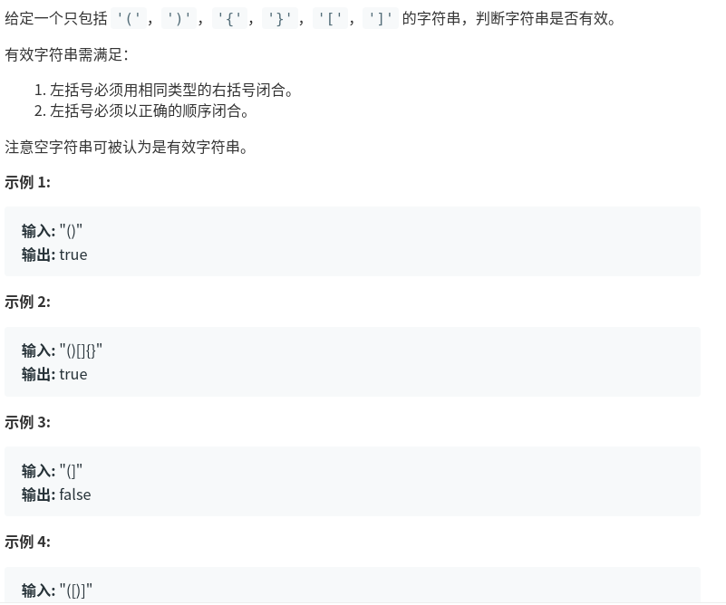

题目描述：有效的括号
题目链接：
[有效的括号](https://leetcode-cn.com/problems/valid-parentheses/)
描述如下


自己的想法：
首先，括号肯定成对出现，左括号和右括号的个数一定相同，可以通过统计字符的数目来判断。
其次，括号数目满足要求之后呢，如何判断括号必须按照正确的顺序闭合呢。
我看了一会发现，成对的括号中间的字符必定为偶数个，如果为奇数个就一定会错，那么判断所有的成对的如果每两个成对的括号中间都为偶数个字符那么就证明是ok的 

还是要使用堆栈的方式，依次判断，左边括号就加入元素，注意如果是右边括号，并且当前右边括号对应的左边括号和堆栈中最后一个元素一样那么就弹出，否则不弹出，比如"([)]",如果不加那个判断就会出错。


代码如下：
```
class Solution:
    def isValid(self, s: str) -> bool:
        hashmap = {')': '(', ']': '[', '}': '{'}
        if s.count('(') != s.count(')') or s.count('[') != s.count(']') or s.count('{') != s.count('}'):
            return False
        else:
            a = []
            for _, i in enumerate(s):
                if i == '(' or i == '[' or i == '{':
                    a.append(i)
                if i == ')' or i == ']' or i == '}':
                    if a[-1] == hashmap[i]:
                        a.pop()
                    else:
                        a.append(i)
            if len(a) == 0:
                return True
            else:
                return False
```