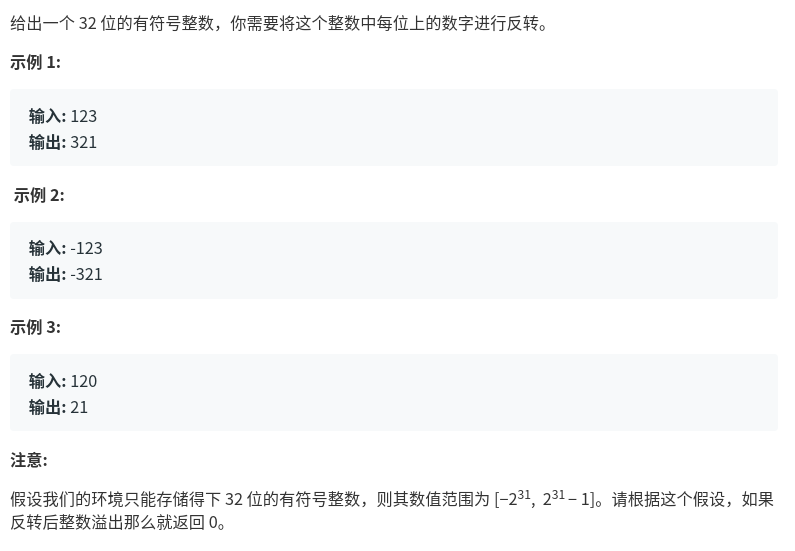

整数反转
=============================


题目描述:，给出一个32 位的有符号整数，你需要将这个整数中每位上的数字进行反转。
题目链接：
[整数反转](https://leetcode-cn.com/problems/reverse-integer/)



> 给出一个 32 位的有符号整数，你需要将这个整数中每位上的数字进行反转。
> 例子
> 
> 输入: 123
> 
> 输出: 321
> 
> 输入: -123
> 
> 输出: -321
> 
> 输入: 120
> 
> 输出: 21
第一种思路:
将数字按照大于0,等于0和等于0分类,大于0的时候就转换为字符列表,遍历之后,用下标和数字得到转换后的值,如果是小于0,另x=-x,再重新进行刚才的步骤.就完了
代码如下
```
def reverse(x):
    if x>0:
        str_x=list(str(x))
        l=len(str_x)
        y=0
        for i in range(0,l):
            y+=int(str_x[i])*(10**i)
    if x==0:
        y=0
    if x<0:
        x=-x
        y=0-reverse(x)
    if (y>2**31-1 or y<-2**31):
        y=0
    return y

print(reverse(-23443410))
```