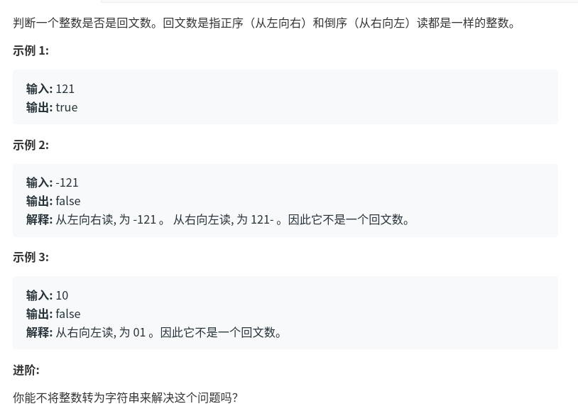

回文数
================

题目描述：判断一个整数是否是回文数。回文数是指正序（从左向右）和倒序（从右向左）读都是一样的整数。
题目链接：
[回文数](https://leetcode-cn.com/problems/palindrome-number/)


判断回文数
判断一个整数是否是回文数。回文数是指正序（从左向右）和倒序（从右向左）读都是一样的整数。
```
输入: 121
输出: true
输入: -121
输出: false
解释: 从左向右读, 为 -121 。 从右向左读, 为 121- 。因此它不是一个回文数。
输入: 10
输出: false
解释: 从右向左读, 为 01 。因此它不是一个回文数。
```

解题思路,首先这题目有点像之前做的翻转的一个题,那么就会想到判断翻转之后两个数是否相等,如果是负数肯定不行,如果是正数或者是0,就翻转下,两个数相等就是回文数.否则不是.
```
class Solution:
    def isPalindrome(self, x):
        print(self.reverse(x))
        return x==self.reverse(x)
    def reverse(self,x):
        if x>0:
            str_x=list(str(x))
            l=len(str_x)
            y=0
            for i in range(0,l):
                y+=int(str_x[i])*(10**i)
        if x==0:
            y=0
        if x<0:
            y=0
        return y

```
执行用时 :
88 ms
, 在所有 python3 提交中击败了
44.90%
的用户

内存消耗 :
12.6 MB
, 在所有 python3 提交中击败了
99.64%
的用户